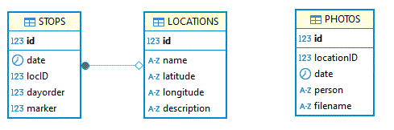

<H1>This is a travel with friends app.</H1>  
Over the years I have gone to a bunch of places with a bunch of friends. 
I usially save my photos from trips based on the date they were taken, but there are many more options to view the photos: 
at a place since specified date, for example can show you all the photos at Bass lake since 2010. Provided you went back a number of times results could be interesting :)
Or you can ask to see all the photos of a certain person, regardless of the place and date. 
Another thing I wanted to look at is the route I took each day, as those were long and interesting. 
Therefore you can select the day and the app will show you the route for that day, and the photos at your points of interest that day in that spot.
This is the backend written in Java, the front end is in another repo. 

<H3>Technologies used</H3> 
<ul>
<li>Java</li> <li>Spring Boot</li><li>JPQL and Spring Data JPA</li></ul>
<H3>Configuration:</H3>
SpringBoot serves the photos, which are uploaded to location specified in application.properties fileDirectory. 
Meta data about the photos such as date, names of friends and location are stored in the data base. 
Update your data base connection details in application.properties in: 
<ul>
<li>spring.datasource.url</li>
<li>spring.datasource.username</li>
<li>spring.datasource.password</li>
</ul>
I know location can be stored in the photo itself, but I turned that option off, and this is where I regretted that.
This was done using MSSql and the table create script is located in:
trips/database/createDB.txt
That data base is empty. It will fill as you upload photos and routes or if you write your own database script to fill it.

<H3>Photo APIS:</H3> 
GET http://<your_host>:8080/api/v1/locations 
Shows all the locations you have photos at. 

POST http://<your_host>:8080/api/v1/files/upload 
uploads your photo to disk and saves meta data about it in the data base.

PUT http://<your_host>:8080/api/v1/photos/update/19 
parametres: locationId, people, date
Updates the data about an existing photo. The date is in the format 2023-01-17 and if the date changes, the file is moved to the appropriate folder.
If there are a few people in the photo, their names are separated by a comma. Example: Mike,Jane,Vica

GET http://<your_host>/api/v1/photos/exact/14/2023-01-17 
gets information about photos at location id 14 on the EXACT date of 2023-01-17.
Information includes the URL on your_host where that photo is. (Provided you uploaded any photos)

GET http://<your_host>/api/v1/photos/14/2020-01-17 
gets information about photos at location id 14 SINCE the date of 2020-01-17 and onwards.

GET http://<your_host>:8080/api/v1/photos/name/list 
Flat  list of all the people you took photos with. 
If you have a photo with Jane and Mike, your name, Mike and Jane will show up as separate entries.
If you have 77 photos of Mike, his name will only appear once.

<H3>Route APIs:</H3> 
GET http://<your_host>:8080/api/v1/stops/years 
list of years of the trips in the route table of the data base.

GET http://<your_host>:8080/api/v1/stops/dates/byyear/2017 
list of dates of the routes by given year, in this example 2017

GET http://<your_host>:8080/api/v1/stops/bydate/2023-01-11 
list of stops at a given date, in this example 2023-01-11(format yyyy-MM-dd)
Those are the same locations stated in the Locations table.
